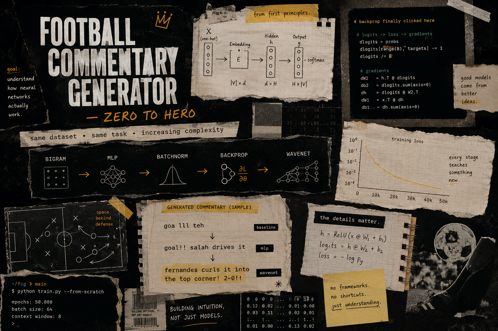
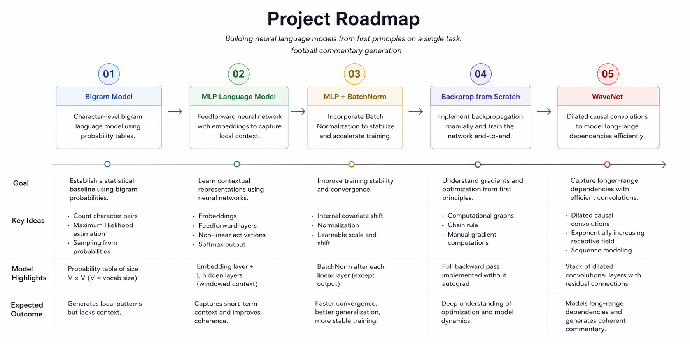

# Football Commentary Generator — Zero to Hero

I got tired of treating deep learning like a black box.

So I rebuilt a language model stack from scratch —
starting with simple bigram probabilities and gradually scaling toward WaveNet.

Same dataset.
Same task.
Increasing complexity.

At each stage the model gets better, but more importantly, the underlying ideas become clearer.

The goal wasn't to build the best football text generator.

The goal was to understand why these models work at all.

> Inspired heavily by Andrej Karpathy's neural network course.

---



---

## The Journey

This project follows the same football commentary dataset through multiple stages:

- bigrams
- MLPs
- batch normalization
- manual backpropagation
- WaveNet

Each stage adds one new idea and tries to understand what actually changes.

---



---

## Why football commentary?

Football commentary is chaotic in a really fun way.

It has:
- repeated phrases
- emotional reactions
- scorelines
- player names
- weird punctuation everywhere

which makes it perfect for watching models slowly go from nonsense text to surprisingly coherent outputs.

---

## Stage Evolution

### 01 — Bigram

```txt
"goa lll teh"
```

Pure character statistics.
No understanding. No memory.

---

### 02 — MLP

```txt
"goal!! salah drives it"
```

Embeddings and context windows finally start producing recognizable patterns.

---

### 03 — BatchNorm

Training becomes way more stable.

This was the stage where optimization tricks started making practical sense.

---

### 04 — Backprop from scratch

No `loss.backward()`.

Every gradient is computed manually.

This was also the stage where neural nets stopped feeling magical.

---

### 05 — WaveNet

```txt
"fernandes curls it into the top corner! 2-0!!"
```

Longer context.
Better structure.
Much more coherent outputs.

---

## Things I learned

- BatchNorm matters a lot more than I expected.
- Manual backprop forces you to actually understand tensor flow.
- Bigger models mean nothing without stable optimization.
- Character-level models can still learn surprisingly good structure.

---

## Repo Structure

```txt
Football-Commentary-Generator/
│
├── assets/
├── 01_bigrams/
├── 02_mlp/
├── 03_batchnorm/
├── 04_backprop/
├── 05_wavenet/
│
└── README.md
```

---

This project wasn't really about football commentary.

Football was just the medium.

The real goal was understanding neural networks from first principles.